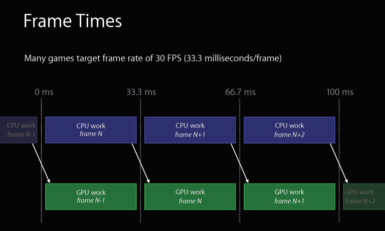
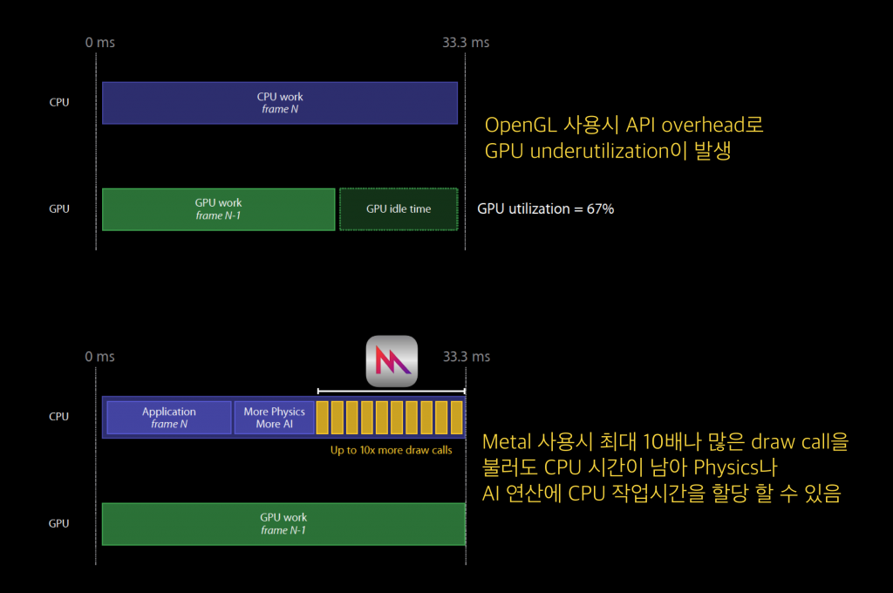

  

5년 전 쯤 OpenGL을 이용하여 video player를 만든 경험이 있습니다. 물론 AVPlayer를 통해서도 아주 손쉽게 video player를 구현할 수 있습니다만... OpenGL을 썼던 이유는 360 Camera preview video player를 만들기 위함이었죠. 이제 OpenGL도 [deprecated][1] 된 마당에 새로운?(이미 [2014.6월에 발표된...ㅎ][2] Metal API를 공부하면서 기존의 앱을 업그레이드 해보려 합니다.

# 1. 들어가면서

이번 Basic에는 아래 2개의 case에 대해서 다뤄보도록 하겠습니다. 

* What is the Metal
  * OpenGL vs Metal 
  * Draw call
* What is the MetalKit

일단 주제만 나열했는데도 정신이 혼미해지고 당이 딸리기 시작하네요. 그만큼 제게는 무거운 주제인 것 같습니다. 하지만... 시작이 반이라 하였으니 시작해 보도록 하죠.

## What is the Metal

2014년, Apple 수석 부사장인 [Craig Federighi][3] 는 WWDC 2014에서 Metal을 처음 소개합니다. 이 분이 나와서 발표하는 날은 긴장을 좀 해야죠? iOS 8부터 지원되었으며 [A7][4] 코어를 사용하는 iPhone 및 iPad 제품에 지원이 되다가 이후 tvOS, macOS 등으로 그 영역을 넓혀 갔습니다. ([History 참고][5])

좀 지루한 이야기를 계속 해보겠습니다.

### OpenGL vs Metal
[OpenGL][6]은 [cross-language][7], [cross-platform][8] 입니다. 즉 동일한 문법의 언어로 다양한 platform에서 graphic관련 작업을 할 수 있게 도와주는 API 입니다. 이와는 반대로 Metal API는 Swift, Objective-C 에 의해 호출될 수 있는 객체지향 API 입니다. 물론 [Apple processor][9] 에서만 동작하는 API지요.

또한 Metal은 다음과 같은 특징을 가집니다.

1. Low-overhead interface
- Metal은 성능에 있어 소위 숨겨진 병목현상들을 제거하도록 설계되었습니다. 예를들어 [state validation][10]과 같은 경우 입니다.
2. 메모리 관리
- Metal framework는 GPU memory에 할당되어 있는 buffer와 texture 객체를 다룹니다. Texture 객체는 특별한 pixel format을 가지고 있고 texture image 및 attachments등에 사용될 수 있습니다.
3. Graphic과 Compute operations에 대한 통합지원
- Metal은 graphic operation과 compute operation에 동일한 data structure 와 resource를 사용합니다. (Textures, buffers, commmand queue 등) 게다가 Metal의 shading language는 graphic functions와 compute function을 동시에 지원합니다. 또한 Metal framework은 runtime interface - graphic shader - compute function간 자원 공유를 가능하게 합니다.
4. Precompiled shader
- Metal의 shader는 buildtime에 compile되고 runtime시에 load됩니다. (물론 runtime시에 compile도 지원합니다.)

*** Metal app은 Metal command를 background에서 실행할 수 없습니다. 그럴 경우 앱은 종료되게 됩니다. ***

### Draw call

Metal은 low-level,low-overhead HW-accelerated 3D 그래픽 엔진 입니다. Metal과 GPU간의 layer는 OpenGL의 그것과는 다르게 상대적으로 아주 얇습니다. 그 의미는 OpenGL에 비해 Metal이 overhead가 적다는 이야기 이겠지요. 아래 그림을 한번 보겠습니다.

  
  

App과 Core간 상대적으로 두꺼운 API layer를 가진 OpenGL abstraction layer는 다양한 플랫폼에서 OpenGL API를 사용할 수 있도록 하는 잇점이 있습니다. 하지만 이로인해 발생하는 가장 큰 문제점은 바로 상당한 양의 overhead가 발생한다는 것입니다.

이 overhead로 인해 발생하는 가장 큰 문제점은 바로 draw call throughput이 떨어진다는 것입니다. Draw call은 CPU가 GPU에게 어떤 object를 한 frame 기간동안 render하라고 명령하는 것이라 볼 수 있습니다. 또한 이미 CPU는 고성능의 GPU를 따라가기 벅차고 주어진 시간동안 high level graphics 를 모두 처리하는 것도 벅차게 됩니다. 이러한 overhead가 발생하는 가장 큰 이유는 기존 OpenGL은 draw call이 진행될 때 [shader compile][11]과 [state validation][10]이 CPU에서 일어나기 때문입니다. 이 때문에 CPU는 빠듯하게 작업을 수행하게 되며 여유시간이 없으므로 physics processing과 기타 object를 더 그릴 수 있는 시간이 자연스럽게 줄어들게 됩니다.

  
  
  
  <em>[출처: Metal API가 OpenGL보다 효율적인 이유][14]</em>

Metal의 draw call time은 OpenGL과 비교할 때 최대 약 10배로 많다고 합니다. 그만큼 GPU의 idle time도 줄일 수 있고, CPU도 다른 목적으로 더 사용할 수 있게 됩니다.

## MetaKit

Apple은 WWDC 2015에서 Metal로 통하는 문(gateway)으로서 MetalKit을 발표했습니다. Metal 기반의 app을 돌리기 위해 수행해야 하는 수 많은 형식적인 code들을 줄여주는 utilities를 제공하는 framework이라 보시면 되겠습니다. 그리고 MetalKit은 아래와 같은 주요한 기능을 가집니다.

1. Texture loading: [MTKTextureLoader][12]를 통해 Metal texture에 image asset을 쉽게 loading하도록 도와줍니다.
2. View management: [MTKView][13]를 사용함으로서, Screen에 뭔가를 render하기 위한 code의 양을 줄여줍니다.
3. Model I/O integration: Metal buffer에 model asset을 효율적으로 load하도록 도와주며, built-in container를 통해 mesh data를 관리하도록 도와줍니다.

일단 저도 잘 모르겠는 단어들을 나열하느라 좀 기운이 빠지는데요. 공부하면서 알아가는 기쁨이 있기를 바라며... 다음 포스트를 준비하러 가겠습니다.

[1]: https://developer.apple.com/documentation/opengles/
[2]: https://ko.wikipedia.org/wiki/%EB%A9%94%ED%83%88_(API))
[3]: https://www.apple.com/kr/leadership/craig-federighi/
[4]: https://en.wikipedia.org/wiki/Apple_A7
[5]: https://en.wikipedia.org/wiki/Metal_(API)
[6]: https://en.wikipedia.org/wiki/OpenGL
[7]: https://en.wikipedia.org/wiki/Language-independent_specification
[8]: https://en.wikipedia.org/wiki/Cross-platform
[9]: https://en.wikipedia.org/wiki/Apple-designed_processors
[10]: https://www.khronos.org/registry/OpenGL-Refpages/gl2.1/xhtml/glValidateProgram.xml
[11]: https://www.khronos.org/opengl/wiki/Shader_Compilation
[12]: https://www.google.com/url?sa=t&rct=j&q=&esrc=s&source=web&cd=1&ved=2ahUKEwi_xJ3NjPvnAhVXed4KHVOSAmYQFjAAegQIBxAC&url=https%3A%2F%2Fdeveloper.apple.com%2Fdocumentation%2Fmetalkit%2Fmtktextureloader&usg=AOvVaw0vm5MZ9Ykg9ZdGlVdwRTki
[13]: https://developer.apple.com/documentation/metalkit/mtkview
[14]: http://donghyun53.net/metal-api%EA%B0%80-opengl%EB%B3%B4%EB%8B%A4-%ED%9A%A8%EC%9C%A8%EC%A0%81%EC%9D%B8-%EC%9D%B4%EC%9C%A0/
